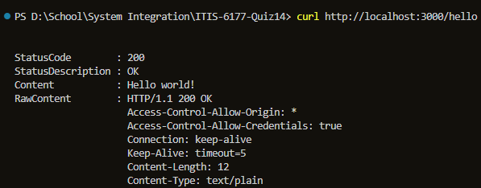
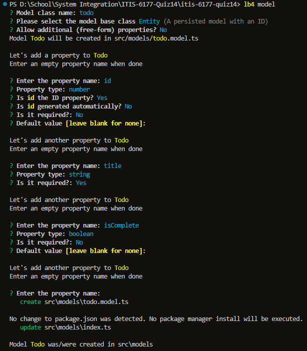
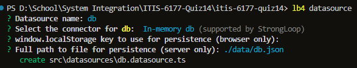
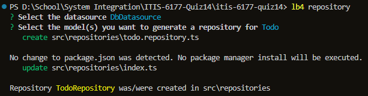
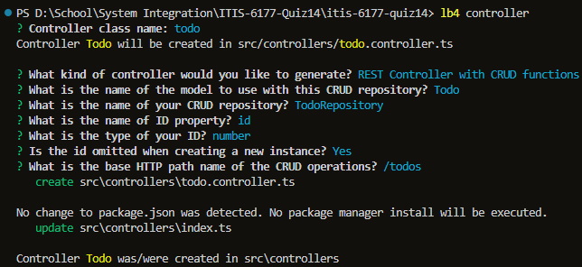
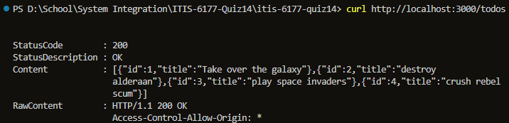
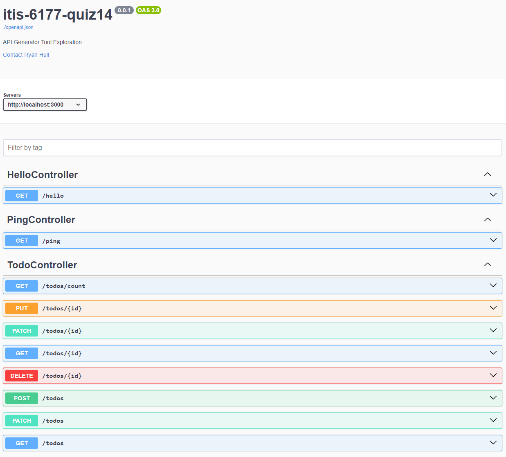

# Quiz 14 - Automatic Api Generator

Ryan Hull, 11/14/2023

## Description

The tool chosen for this assignemnt was LoopBack v4

## Steps taken to complete assignment

1. Install LoopBack v4 CLI
`npm install -g @loopback/cli`
2. Create a new LoopBack project
`lb4 app`
3. Test the new project
`npm start`
4. Add a controller
`lb4 controller` then select `REST Controller` and name it `hello`
5. Test application
`npm start` then navigate to `http://localhost:3000/hello`

6. Create Todo model
`lb4 model` then select `Entity` and name it `todo`

7. Create datasource
`lb4 datasource`

8. Add db.json mock Database
`touch src/data/db.json` then add some mock Todos
9. Add repository layer to perform CRUD operations
`lb4 repository` then select `Todo` and `In-memory db (supported by @loopback/repository)`

10. Add controller to expose repository methods for Todos
`lb4 controller` then select `REST Controller` and name it `todo`

11. Test application
`npm start` then navigate to `http://localhost:3000/todo`, `http://localhost:3000/todo/1`, and `htto://localhost:3000/explorer` to see the generated Swagger Docs  

